# Документация проекта (Backend)

## Используемая база данных
В проекте используется **PostgreSQL** в качестве основной базы данных. PostgreSQL — это мощная, открытая реляционная система управления базами данных, которая обеспечивает надежность, масштабируемость и поддержку таких функций, как внешние ключи, транзакции и поддержка JSON.

### Схема базы данных
База данных состоит из двух основных таблиц:
1. **`categories`**: Хранит категории товаров.
    - `id`: Первичный ключ (автоинкрементное целое число).
    - `name`: Уникальное название категории (строка).
    - `created_at`: Временная метка создания категории.
    - `updated_at`: Временная метка последнего обновления категории.

2. **`products`**: Хранит информацию о товарах.
    - `id`: Первичный ключ (автоинкрементное целое число).
    - `name`: Название товара (строка).
    - `description`: Описание товара (текст).
    - `category_id`: Внешний ключ, ссылающийся на таблицу `categories`.
    - `quantity`: Количество товара на складе (целое число).
    - `price`: Цена товара (десятичное число).
    - `created_at`: Временная метка создания товара.
    - `updated_at`: Временная метка последнего обновления товара.

## API Endpoints

### Товары (Products)
1. **Получить все товары**
    - **Метод**: `GET`
    - **Эндпоинт**: `/api/products`
    - **Параметры запроса**:
        - `limit`: Количество товаров для возврата (по умолчанию: 10).
        - `offset`: Количество товаров для пропуска (по умолчанию: 0).
    - **Ответ**: Список товаров.

2. **Получить товар по ID**
    - **Метод**: `GET`
    - **Эндпоинт**: `/api/products/:id`
    - **Ответ**: Информация о товаре.

3. **Создать товар**
    - **Метод**: `POST`
    - **Эндпоинт**: `/api/products`
    - **Тело запроса**:
      ```json
      {
        "name": "Ноутбук",
        "description": "Высокопроизводительный ноутбук",
        "category_id": 1,
        "quantity": 10,
        "price": 1200.00
      }
      ```
    - **Ответ**: Созданный товар.

4. **Обновить товар**
    - **Метод**: `PUT`
    - **Эндпоинт**: `/api/products/:id`
    - **Тело запроса**:
      ```json
      {
        "name": "Обновленный ноутбук",
        "description": "Обновленный высокопроизводительный ноутбук",
        "category_id": 1,
        "quantity": 5,
        "price": 1500.00
      }
      ```
    - **Ответ**: Обновленный товар.

5. **Удалить товар**
    - **Метод**: `DELETE`
    - **Эндпоинт**: `/api/products/:id`
    - **Ответ**: Удаленный товар.

### Категории (Categories)
1. **Получить все категории**
    - **Метод**: `GET`
    - **Эндпоинт**: `/api/categories`
    - **Ответ**: Список категорий.

2. **Получить категорию по ID**
    - **Метод**: `GET`
    - **Эндпоинт**: `/api/categories/:id`
    - **Ответ**: Информация о категории.

3. **Создать категорию**
    - **Метод**: `POST`
    - **Эндпоинт**: `/api/categories`
    - **Тело запроса**:
      ```json
      {
        "name": "Электроника"
      }
      ```
    - **Ответ**: Созданная категория.

4. **Обновить категорию**
    - **Метод**: `PUT`
    - **Эндпоинт**: `/api/categories/:id`
    - **Тело запроса**:
      ```json
      {
        "name": "Обновленная электроника"
      }
      ```
    - **Ответ**: Обновленная категория.

5. **Удалить категорию**
    - **Метод**: `DELETE`
    - **Эндпоинт**: `/api/categories/:id`
    - **Ответ**: Удаленная категория.

## Обработка ошибок
API обрабатывает следующие ошибки:
- **400 Bad Request**: Некорректные входные данные или ошибки валидации.
- **404 Not Found**: Ресурс не найден (например, неверный `category_id`).
- **500 Internal Server Error**: Непредвиденные ошибки сервера.

## Тестирование

### Тестовые сценарии
1. **Создание товара с неверным `category_id`**
    - **Эндпоинт**: `POST /api/products`
    - **Тело запроса**:
      ```json
      {
        "name": "Ноутбук",
        "description": "Высокопроизводительный ноутбук",
        "category_id": 999,
        "quantity": 10,
        "price": 1200.00
      }
      ```
    - **Ожидаемый ответ**:
      ```json
      {
        "error": "Категория не найдена"
      }
      ```
    - **Код состояния**: `404 Not Found`

2. **Создание категории с дублирующимся именем**
    - **Эндпоинт**: `POST /api/categories`
    - **Тело запроса**:
      ```json
      {
        "name": "Электроника"
      }
      ```
    - **Ожидаемый ответ**:
      ```json
      {
        "error": "Ресурс уже существует"
      }
      ```
    - **Код состояния**: `400 Bad Request`

3. **Получение всех товаров с пагинацией**
    - **Эндпоинт**: `GET /api/products?limit=5&offset=0`
    - **Ожидаемый ответ**: Список из 5 товаров.

4. **Обновление товара**
    - **Эндпоинт**: `PUT /api/products/1`
    - **Тело запроса**:
      ```json
      {
        "name": "Обновленный ноутбук",
        "description": "Обновленный высокопроизводительный ноутбук",
        "category_id": 1,
        "quantity": 5,
        "price": 1500.00
      }
      ```
    - **Ожидаемый ответ**: Обновленный товар.

5. **Удаление категории**
    - **Эндпоинт**: `DELETE /api/categories/1`
    - **Ожидаемый ответ**: Удаленная категория.

## Скриншоты
### Товары
1. **Создание товара с неверным `category_id`**:
    - 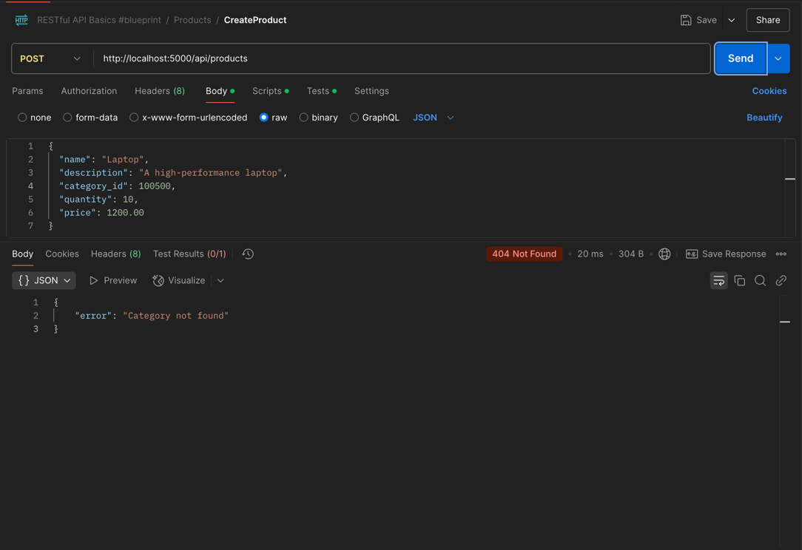

2. **Создание категории с дублирующимся именем**:
    - 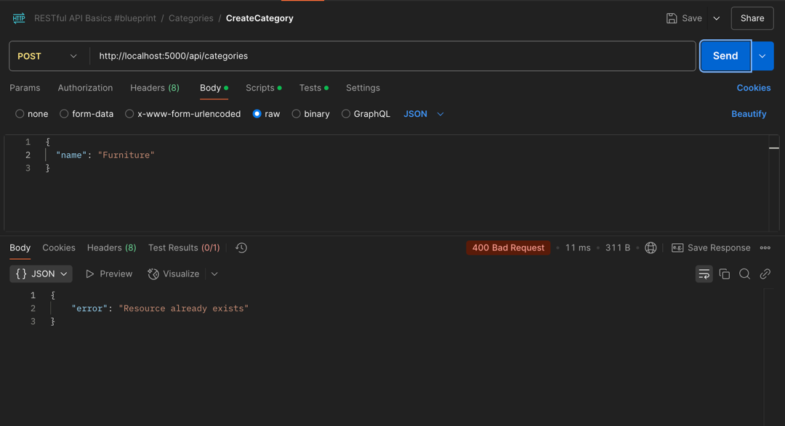

3. **Получение всех товаров с пагинацией**:
    - 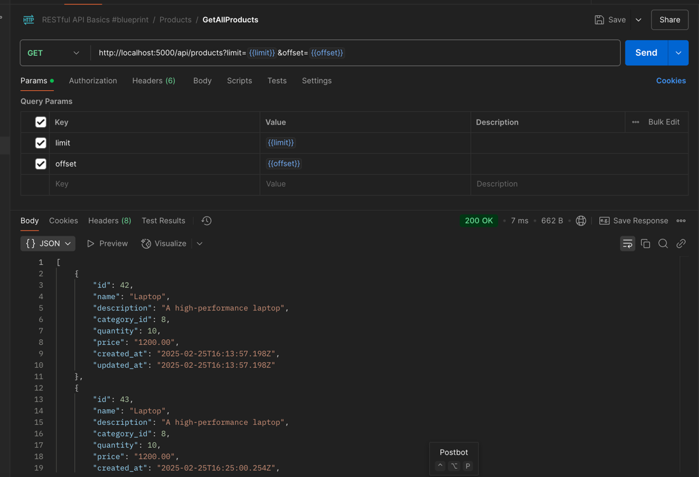

4. **Создание товара**:
    - 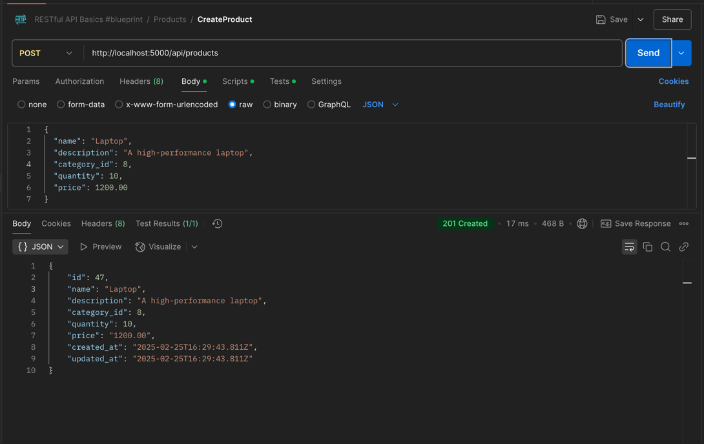

5. **Обновление товара**:
    - 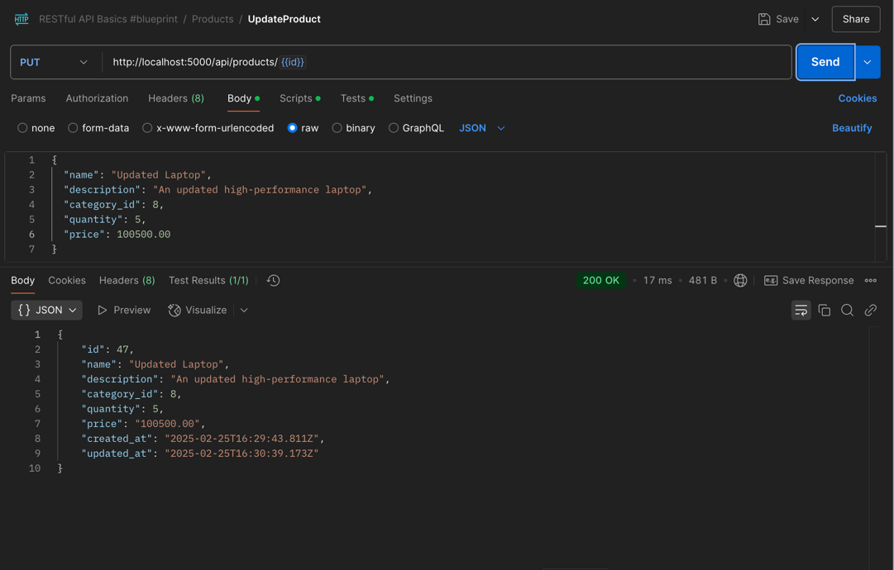

6. **Получение товара по id**:
    - 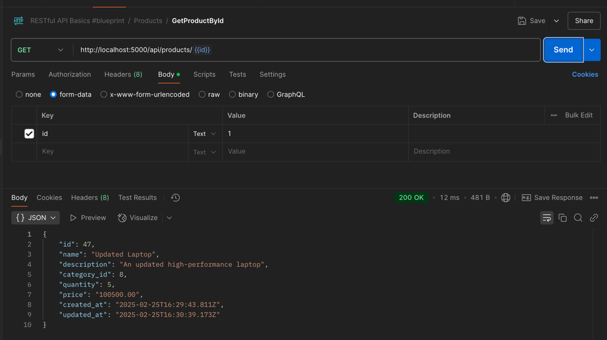
   
7. **Удаление товара**:
    - 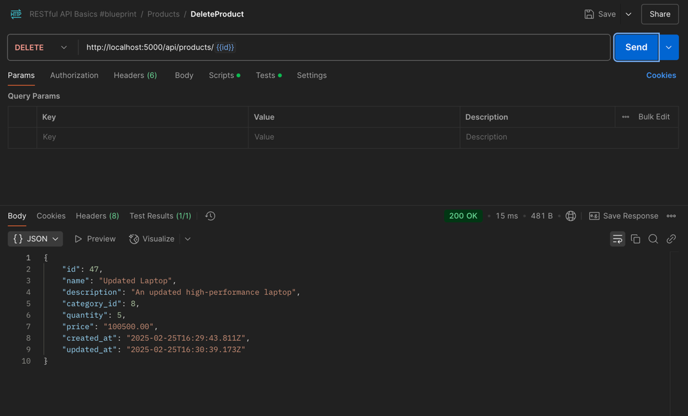

### Категории
1. **Получение списка категорий**:
    - 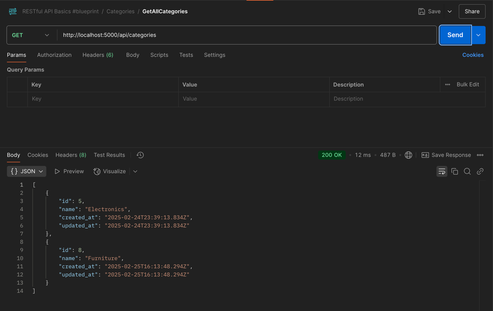

2. **Получение категории по id**:
    - 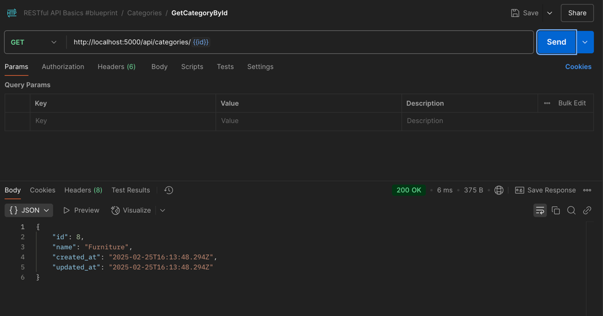
   
3. **Создание категории**:
   - 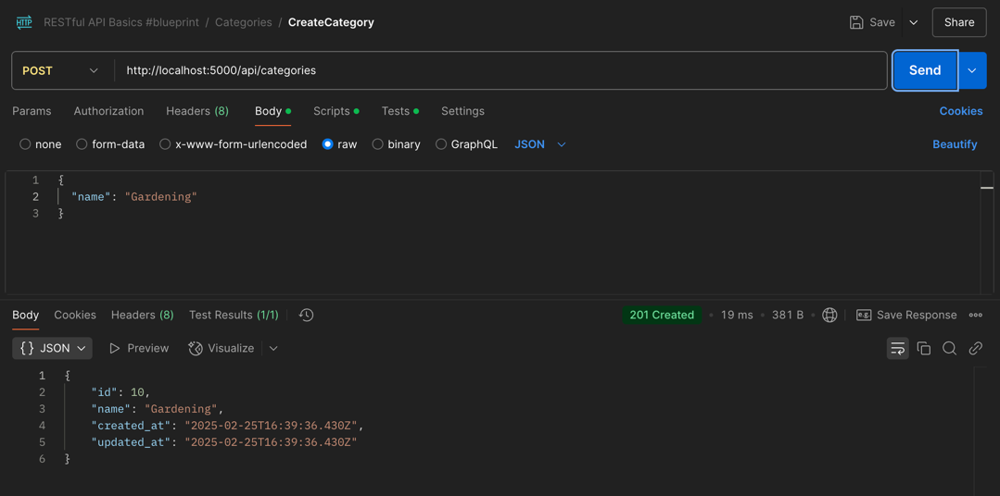
   
4. **Обновление категории**:
   - 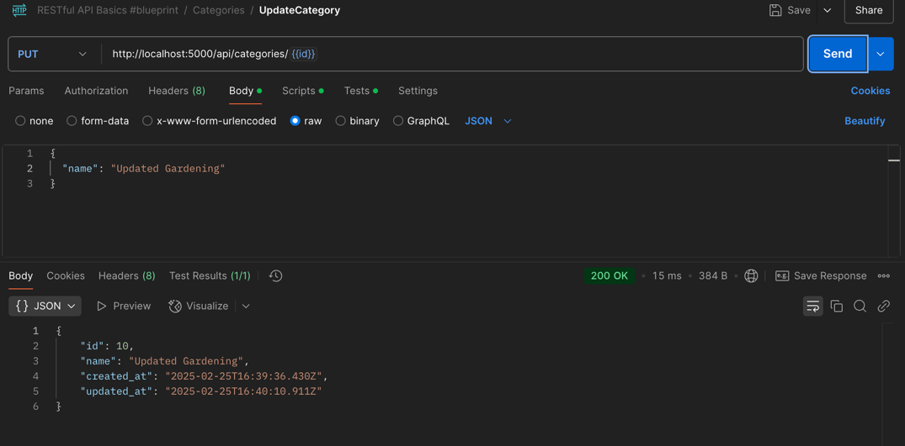
    
5. **Удаление категории**:
   - 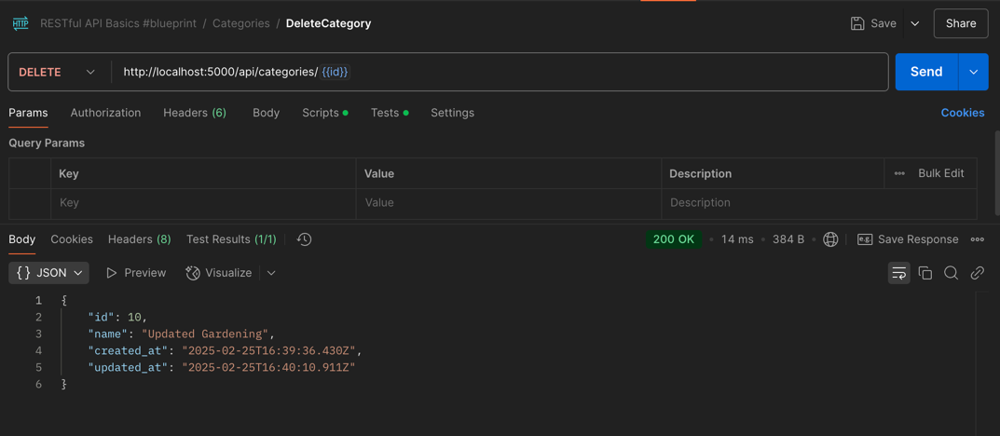

---
